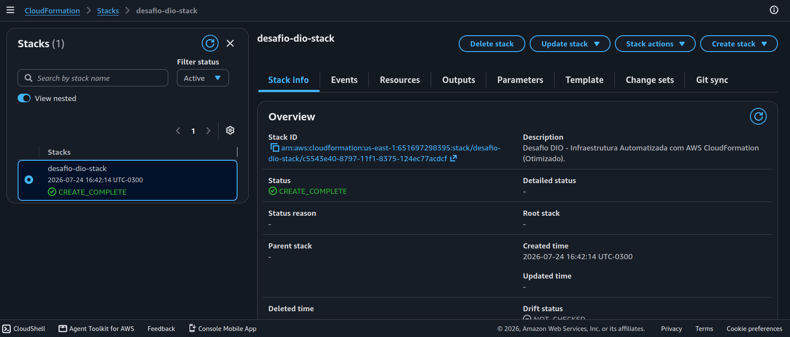
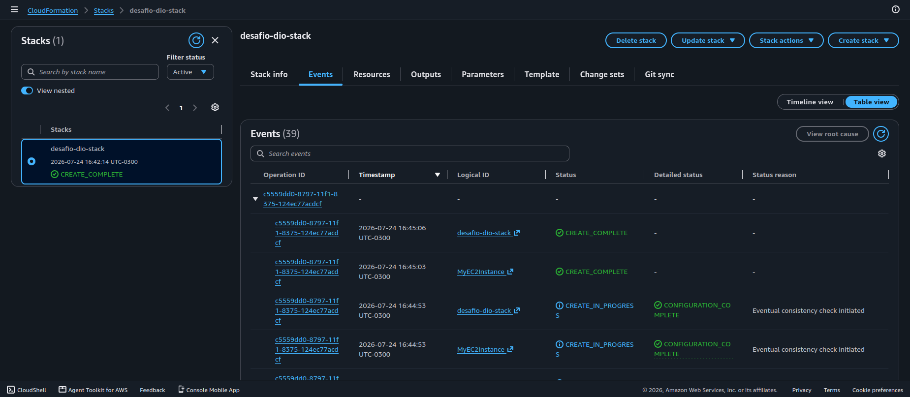
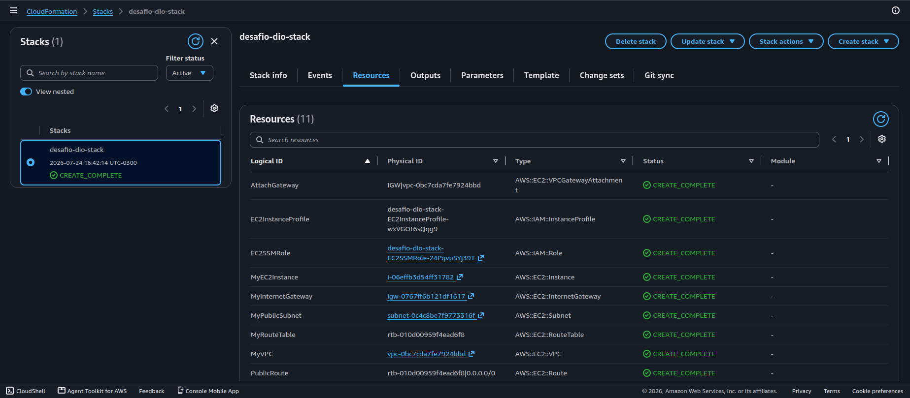
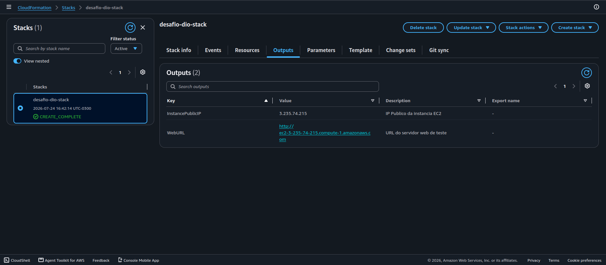
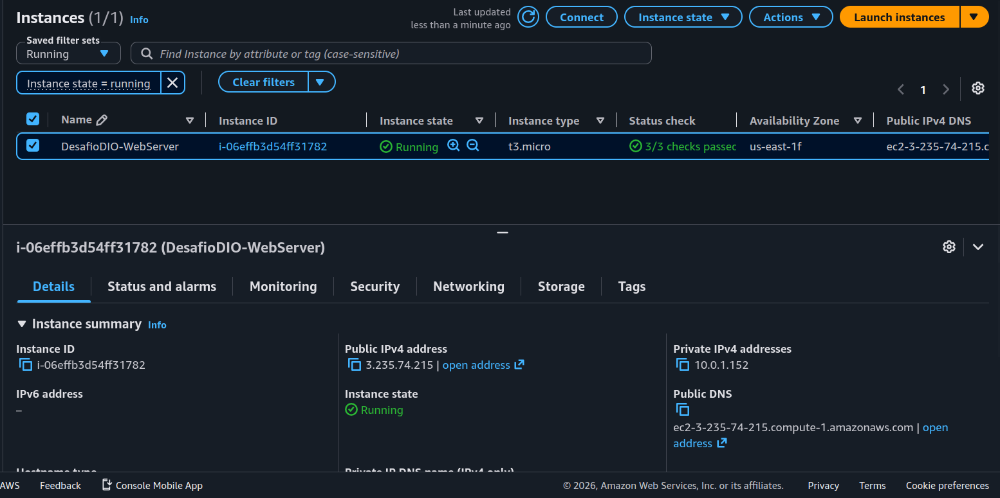
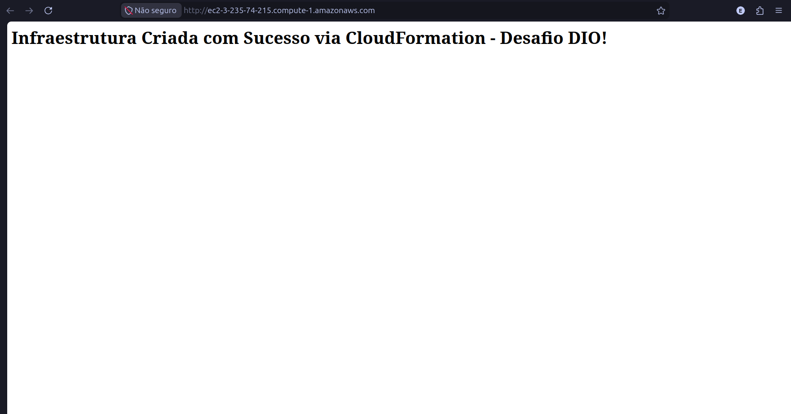

# ☁️ Desafio DIO: Infraestrutura Automatizada com AWS CloudFormation

---

- **Bootcamp:** GFT - Fundamentos de Cloud com AWS
- **Plataforma:** Digital Innovation One (DIO)
- **Autor:** Evelyn Oliveira Bonatto
- **Status:** 🛠️ Concluído

---

## 📌 Descrição do Projeto

Este projeto consiste na automação da implantação de uma infraestrutura de rede e servidor web na AWS utilizando **AWS CloudFormation** como ferramenta de Infraestrutura como Código (IaC).

O desafio tem como objetivo demonstrar na prática o provisionamento declarativo, reprodutível e seguro de recursos na nuvem.

---

## 🏗️ Arquitetura Provisionada

A stack do CloudFormation provisiona automaticamente a seguinte estrutura:

- **Rede (VPC):** VPC com bloco CIDR `10.0.0.0/16`.
- **Roteamento:** Internet Gateway (IGW) atrelado à VPC e tabela de rotas configurada para acesso à internet.
- **Subnet Pública:** Subnet com atribuição automática de IPs públicos (`10.0.1.0/24`).
- **Segurança (Security Group):** Liberação de tráfego de entrada para acesso web via porta `80` (HTTP) e gerenciamento seguro via **AWS Systems Manager (SSM)**.
- **Servidor Web (EC2):** Instância baseada em **Amazon Linux 2023** configurada via `UserData` para instalar e inicializar automaticamente o servidor **Apache (httpd)**.

---

## 📁 Estrutura do Repositório

```text
.
├── template-infra.yml    # Template CloudFormation
├── README.md             # Documentação do projeto
└── images/               # Evidências de execução no console AWS

---

## 📸 Evidências de Execução (Screenshots)

### 1. Stack Criada no CloudFormation

> Status da stack confirmando o provisionamento dos recursos (`CREATE_COMPLETE`).



---

### 2. Eventos da Stack (Events)

> Registro dos eventos e criação em sequência dos recursos.



---

### 3. Recursos Criados (Resources)

> Visão geral de todos os recursos AWS provisionados pela stack.



---

### 4. Outputs da Stack

> Valores de saída contendo o IP Público e a URL gerada dinamicamente.



---

### 5. Instância EC2 em Execução

> Detalhes da instância criada associada ao Security Group e VPC.



---

### 6. Servidor Web em Funcionamento

> Validação do servidor Apache rodando no Amazon Linux 2023 acessado via navegador.



---

## 🔗 Conecte-se Comigo

[](https://www.linkedin.com/in/evelyn-bonatto/)
```
